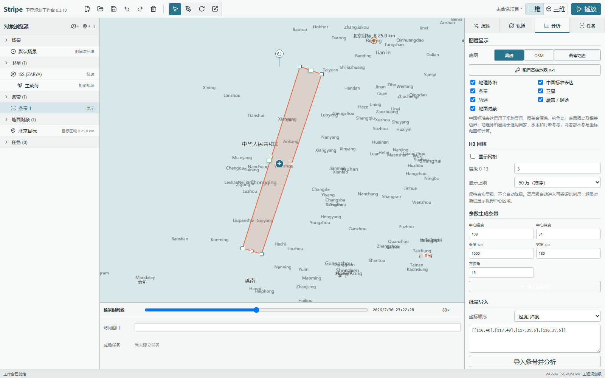
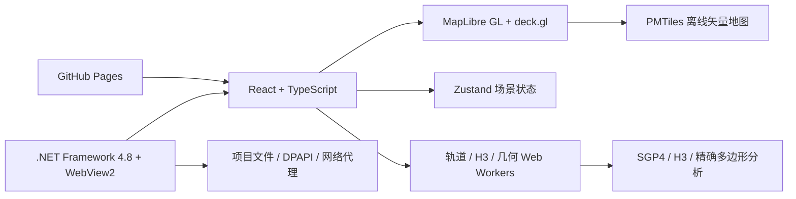

<div align="center">
  
  <h1>Stripe 卫星条带规划工具</h1>
  <p><strong>离线优先、面向工程规划的轻量卫星任务工作台</strong></p>
  <p>Satellite stripe planning, orbit propagation and coverage analysis for Windows.</p>

  <p>
    <a href="https://github.com/Jensen-Yao/stripe/releases/latest"></a>
    
    
    
  </p>

  <p>
    <a href="https://jensen-yao.github.io/stripe/"><strong>在线体验</strong></a>
    ·
    <a href="https://github.com/Jensen-Yao/stripe/releases/latest"><strong>下载 Windows 版</strong></a>
    ·
    <a href="https://github.com/Jensen-Yao/stripe/issues"><strong>问题反馈</strong></a>
  </p>
</div>



## 项目定位

Stripe 用于卫星条带设计、轨道快速传播、访问窗口和覆盖关系分析。界面参考专业任务分析软件的对象树、场景时间和分析器组织方式，同时保留直接绘制、批量导入和快速查看坐标的轻量工作流。

Windows 安装包采用 `.NET Framework 4.8 + WebView2` 宿主，不捆绑 Electron、Java 或浏览器运行时。当前安装包约 21 MB，并内置完整的离线矢量世界地图。

## 核心能力

| 模块 | 能力 |
|---|---|
| 条带规划 | 任意多节点绘制、参数生成、节点增删、整体移动、WGS84 旋转、主副轴拉伸、偏移复制 |
| 数据交换 | 数组、CSV、GeoJSON、KML 批量导入；经纬度顺序切换；规范化坐标与项目文件导出 |
| 覆盖关系 | 精确交集面积、包含关系、双方覆盖率、A/B 对象标识和结果定位 |
| 轨道传播 | TLE/SGP4/SDP4、经典六根数、ECI 状态矢量、星下点、地面轨迹、高度和速度 |
| 访问分析 | 地面站与带半径目标区域、最小仰角、访问窗口、方位角、斜距和最大仰角 |
| 传感器与任务 | 圆锥/矩形视场、覆盖足迹、重访估算、成像任务和时间冲突检查 |
| 空间网格 | H3 0-13 级 GPU 渲染，支持大规模渐进显示，不静默降低网格层级 |
| 地图 | PMTiles 离线世界地图、OSM、高德二维/球面视图、中国标准地图表达参考层 |

## 快速开始

### Windows 桌面版

从 [最新 Release](https://github.com/Jensen-Yao/stripe/releases/latest) 下载 `Stripe-Setup-0.3.10-x64.exe` 并安装。Windows 10/11 通常已经包含 Microsoft Edge WebView2 Runtime。

桌面版提供完整的项目文件读写、本机加密凭据、Space-Track 数据访问和高德 Web JS API 配置能力。

### 在线版

访问 [jensen-yao.github.io/stripe](https://jensen-yao.github.io/stripe/)。在线版适合直接体验条带绘制、离线矢量地图、三维检查和浏览器内轨道计算；依赖桌面宿主的系统文件与加密凭据功能不可用。

## 典型工作流

1. 在场景中设置开始时间、结束时间、当前时间和采样步长。
2. 导入 TLE、六根数或状态矢量，并传播轨道。
3. 绘制任意多节点条带，或按中心、长度、宽度和方位角生成条带。
4. 添加目标区域或地面站，设置目标半径和最小仰角。
5. 运行重叠、访问窗口、H3 覆盖和重访分析。
6. 保存 `.stripeproj` 项目，或导出条带坐标和分析结果。

## 技术架构



条带、轨迹、覆盖足迹和 H3 网格由 GPU 图层绘制；轨道、网格和几何分析在 Web Worker 中执行，避免阻塞地图交互。GitHub Pages 托管完整静态工作台和 PMTiles 地图，浏览器按字节范围读取所需瓦片，无需整包下载地图。

## 本地开发

环境要求：Node.js 20+、.NET Framework 4.8 开发工具和 Microsoft Edge WebView2 Runtime。

```powershell
git clone https://github.com/Jensen-Yao/stripe.git
cd stripe
npm ci
npm run dev
```

常用命令：

```powershell
npm test                 # 单元测试
npm run test:e2e         # Playwright 端到端测试
npm run build            # Web 与 Windows 宿主构建
npm run dist:win         # 生成 Windows x64 安装包
npm run deploy:pages      # 触发 GitHub Pages 发布
```

重新生成离线地图时运行 `npm run generate:map`。Windows 安装包输出到 `release/Stripe-Setup-0.3.10-x64.exe`。

## 地图与坐标

- 规划对象、轨道结果和面积计算统一使用 WGS84。
- 高德二维显示使用 GCJ-02 适配，数据存储仍保持 WGS84。
- 中国标准地图表达层用于规划显示参考，不参与轨道、坐标或面积计算。
- 离线基础地理数据来自 Natural Earth；中国行政参考几何来自阿里云 DataV。
- 高德地图和 OSM 是可选在线服务，其使用受各自服务条款约束。

## 隐私与凭据

- Space-Track 账号和高德 API 配置使用 Windows DPAPI 加密，只保存在当前用户的本机应用数据目录。
- 凭据不会写入 `.stripeproj`、导出文件或 Git 仓库。
- 高德配置可通过界面选择，也可使用 `STRIPE_AMAP_CONFIG` 环境变量指定本机配置文件。

## 精度边界

当前轻量核心使用 TLE + SGP4/SDP4 和几何可见性模型，适合研究、方案比较和工程规划辅助。结果不用于飞控、碰撞预警、精密定轨或任务安全认证。`orbit-engine` 保留可选 Orekit 科学扩展源码，但不进入轻量安装包。

第三方组件和地图数据许可见 [THIRD_PARTY_NOTICES.md](./THIRD_PARTY_NOTICES.md)。

## 许可证

当前仓库尚未声明开源许可证。源代码可公开查看，但在许可证发布前，不应默认视为获得复制、修改或再分发授权。
